# hello_world

Praktikum Week 5

Nama : Mohammad Naufal Syahandra
Kelas: TI-3A
NIM  : 2241720189

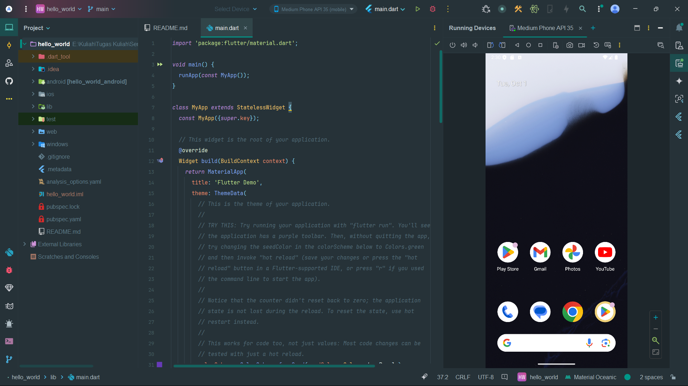

## Menerapkan Widget Dasar

### Langkah 1: Text Widget

Create new file (text_widget,dart)

```dart
import 'package:flutter/material.dart';

class MyTextWidget extends StatelessWidget {
  const MyTextWidget({Key? key}) : super(key: key);

  @override
  Widget build(BuildContext context) {
    return const Text(
        "Nama saya Fulan, sedang belajar Pemrograman Mobile",
        style: TextStyle(color: Colors.red, fontSize: 14),
        textAlign: TextAlign.center);
  }
}
```

import file `text_widget.dart` ke `main.dart`

```dart
children: <Widget>[
  const MyTextWidget(),
  Text('$_counter',style: Theme.of(context).textTheme.headlineMedium,),
]
```

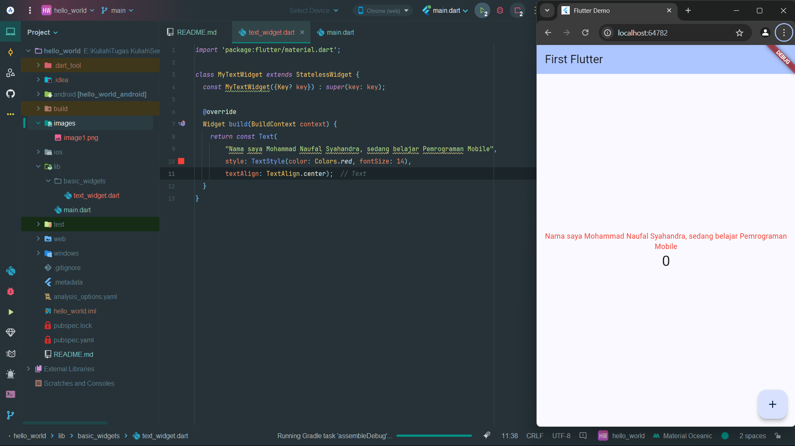

### Langkah 2: Image Widget

Buat sebuah file `image_widget.dart`

```dart
import 'package:flutter/material.dart';

class MyImageWidget extends StatelessWidget {
  const MyImageWidget({Key? key}) : super(key: key);

  @override
  Widget build(BuildContext context) {
    return const Image(
        image: AssetImage("logo_polinema.png")
    );
  }
}
```

Lakukan penyesuaian asset pada file `pubspec.yaml` dan tambahkan file logo Anda di folder `assets`
project hello_world.

* `pubspec.yaml`

```yaml
  assets:
    - assets/logo_polinema.png
```

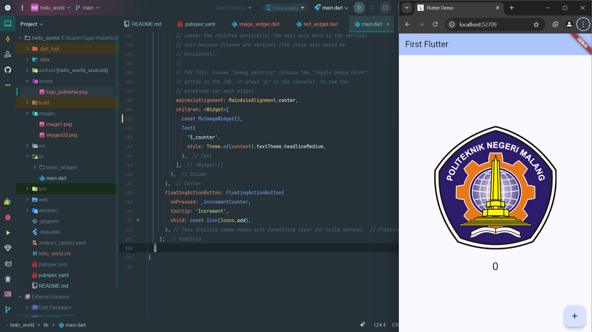

## Menerapkan Widget Material Design dan iOS Cupertino

### Langkah 1: Cupertino Button dan Loading Bar

```dart
import 'package:flutter/cupertino.dart';
import 'package:flutter/material.dart';

class MyCustomCuppertino extends StatelessWidget {
  const MyCustomCuppertino({super.key});

  @override
  Widget build(BuildContext context) {
    return MaterialApp(
      home: Container(
        margin: const EdgeInsets.only(top: 30),
        color: Colors.white,
        child: Column(
          children: <Widget>[
            CupertinoButton(
              child: const Text("Contoh Button"),
              onPressed: () {},
            ),
            const CupertinoActivityIndicator(),
          ],
        ),
      ),
    );
  }
}

```

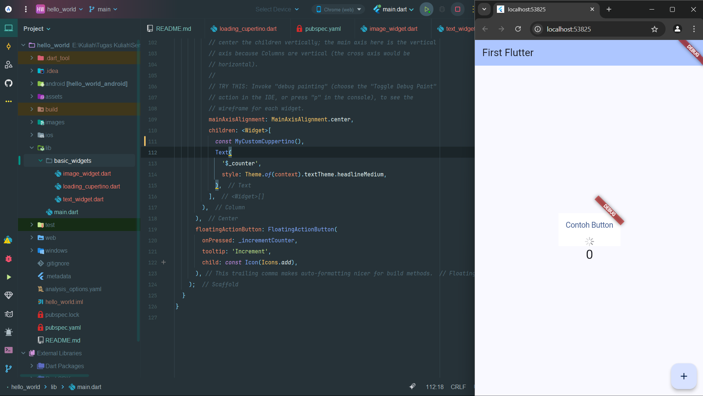

### Floating Action Button (FAB)

```dart
import 'package:flutter/material.dart';

class MyFabWidget extends StatelessWidget {
  const MyFabWidget({super.key});

  @override
  Widget build(BuildContext context) {
    return MaterialApp(
        home: Scaffold(
            floatingActionButton: FloatingActionButton(
                onPressed: () {
                  // Add your onPressed code here!
                },
              backgroundColor: Colors.pink,
                child: const Icon(Icons.thumb_up),
            ),
        ),
    );
  }
}
```

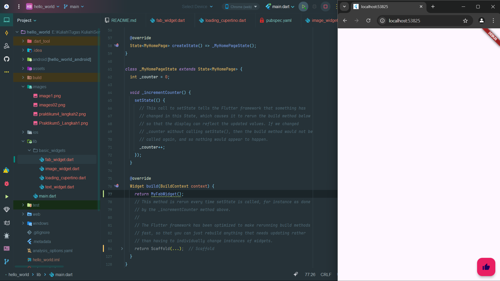

### Scaffold Widget

```dart
import 'package:flutter/material.dart';

void main() {
  runApp(const MyApp());
}

class MyApp extends StatelessWidget {
  const MyApp({Key? key}) : super(key: key);

  // This widget is the root of your application.
  @override
  Widget build(BuildContext context) {
    return MaterialApp(
      title: 'Flutter Demo',
      theme: ThemeData(
        primarySwatch: Colors.red,
      ),
        home: const MyHomePage(title: 'My Increment App'),
    );
  }
}

class MyHomePage extends StatefulWidget {
  const MyHomePage({Key? key, required this.title}) : super(key: key);

  final String title;

  @override
  State<MyHomePage> createState() => _MyHomePageState();
}

class _MyHomePageState extends State<MyHomePage> {
  int _counter = 0;

  void _incrementCounter() {
    setState(() {
      _counter++;
    });
  }

  @override
  Widget build(BuildContext context) {
    return Scaffold(
        appBar: AppBar(
            title: Text(widget.title),
        ),
      body: Center(
        child: Column(
          mainAxisAlignment: MainAxisAlignment.center,
          children: <Widget>[
            const Text(
              'You have pushed the button this many times:',
            ),
            Text(
              '$_counter',
                style: Theme.of(context).textTheme.headlineMedium,
            ),
          ],
        ),
      ),
      bottomNavigationBar: BottomAppBar(
        child: Container(
          height: 50.0,
        ),
      ),
      floatingActionButton: FloatingActionButton(
        onPressed: _incrementCounter,
        tooltip: 'Increment Counter',
          child: const Icon(Icons.add),
      ),
      floatingActionButtonLocation: FloatingActionButtonLocation.centerDocked,
    );
  }
}

```

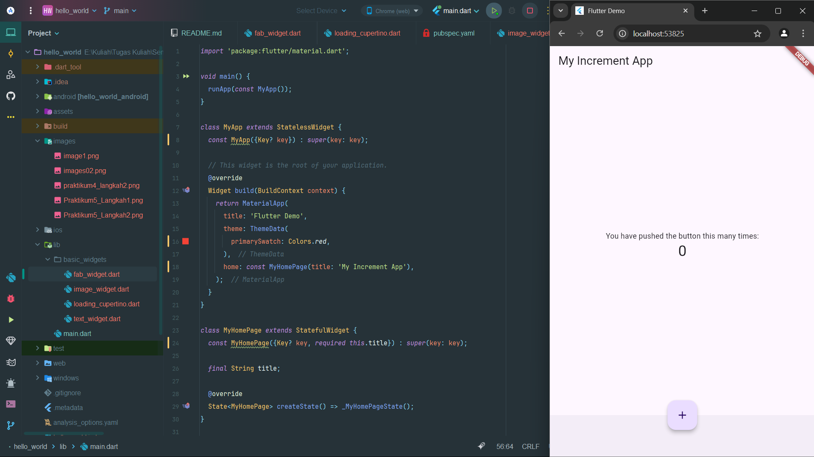

### Dialog Widget

```dart
import 'package:flutter/material.dart';

void main() {
  runApp(const MyApp());
}

class MyApp extends StatelessWidget {
  const MyApp({Key? key}) : super(key: key);

  @override
  Widget build(BuildContext context) {
    return const MaterialApp(
      home: Scaffold(
        body: MyLayout(),
      ),
    );
  }
}

class MyLayout extends StatelessWidget {
  const MyLayout({Key? key}) : super(key: key);

  @override
  Widget build(BuildContext context) {
    return Padding(
      padding: const EdgeInsets.all(8.0),
      child: ElevatedButton(
        child: const Text('Show alert'),
        onPressed: () {
          showAlertDialog(context);
        },
      ),
    );
  }
}

showAlertDialog(BuildContext context) {
  // set up the button
  Widget okButton = TextButton(
    child: const Text("OK"),
    onPressed: () {
      Navigator.pop(context);
    },
  );

  // set up the AlertDialog
  AlertDialog alert = AlertDialog(
    title: const Text("My title"),
    content: const Text("This is my message."),
    actions: [
      okButton,
    ],
  );

  // show the dialog
  showDialog(
    context: context,
    builder: (BuildContext context) {
      return alert;
    },
  );
}
```

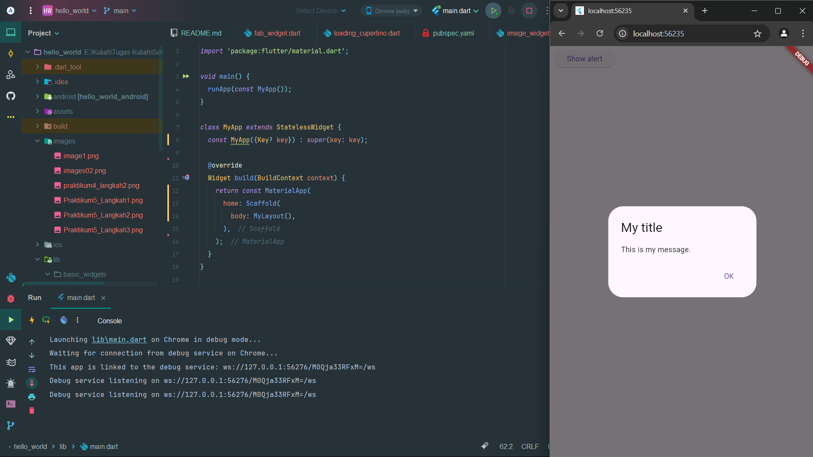

###  Input dan Selection Widget

```dart
import 'package:flutter/material.dart';

void main() {
  runApp(const MyApp());
}

class MyApp extends StatelessWidget {
  const MyApp({Key? key}) : super(key: key);

  @override
  Widget build(BuildContext context) {
    return MaterialApp(
        home: Scaffold(
            appBar: AppBar(title: const Text("Contoh TextField")),
          body: const TextField(
            obscureText: false,
              decoration: InputDecoration(
                  border: OutlineInputBorder(),
                labelText: 'Nama',
              ),
          ),
        ),
    );
  }
}
```

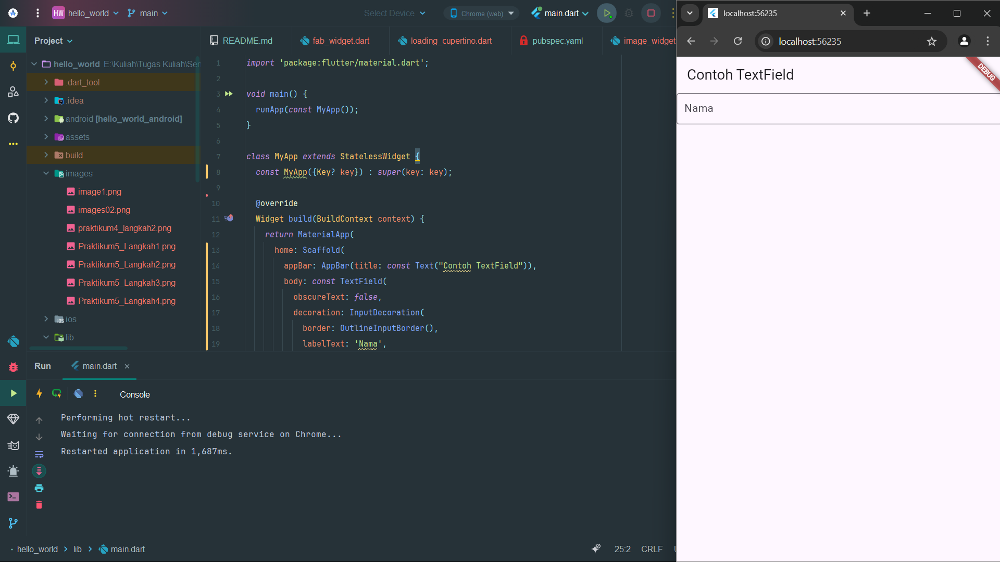

### Date and Time Pickers

```dart
import 'dart:async';
import 'package:flutter/material.dart';

void main() => runApp(const MyApp());

class MyApp extends StatelessWidget {
  const MyApp({super.key});

  @override
  Widget build(BuildContext context) {
    return const MaterialApp(
      title: 'Contoh Date Picker',
        home: MyHomePage(title: 'Contoh Date Picker'),
    );
  }
}

class MyHomePage extends StatefulWidget {
  const MyHomePage({super.key, required this.title});

  final String title;

  @override
  _MyHomePageState createState() => _MyHomePageState();
}

class _MyHomePageState extends State<MyHomePage> {
  // Variable/State untuk mengambil tanggal
  DateTime selectedDate = DateTime.now();

  //  Initial SelectDate FLutter
  Future<void> _selectDate(BuildContext context) async {
    // Initial DateTime FIinal Picked
    final DateTime? picked = await showDatePicker(
        context: context,
        initialDate: selectedDate,
        firstDate: DateTime(2015, 8),
        lastDate: DateTime(2101));
    if (picked != null && picked != selectedDate) {
      setState(() {
        selectedDate = picked;
      });
    }
  }

  @override
  Widget build(BuildContext context) {
    return Scaffold(
        appBar: AppBar(
            title: Text(widget.title),
        ),
      body: Center(
        child: Column(
          mainAxisSize: MainAxisSize.min,
            children: <Widget>[
              Text("${selectedDate.toLocal()}".split(' ')[0]),
              const SizedBox(
                height: 20.0,
              ),
              ElevatedButton(
    onPressed: () => {
      _selectDate(context),
      // ignore: avoid_print
      print(selectedDate.day + selectedDate.month + selectedDate.year)
    },
    child: const Text('Pilih Tanggal'),
              ),
            ],
        ),
      ),
    );
  }
}

```

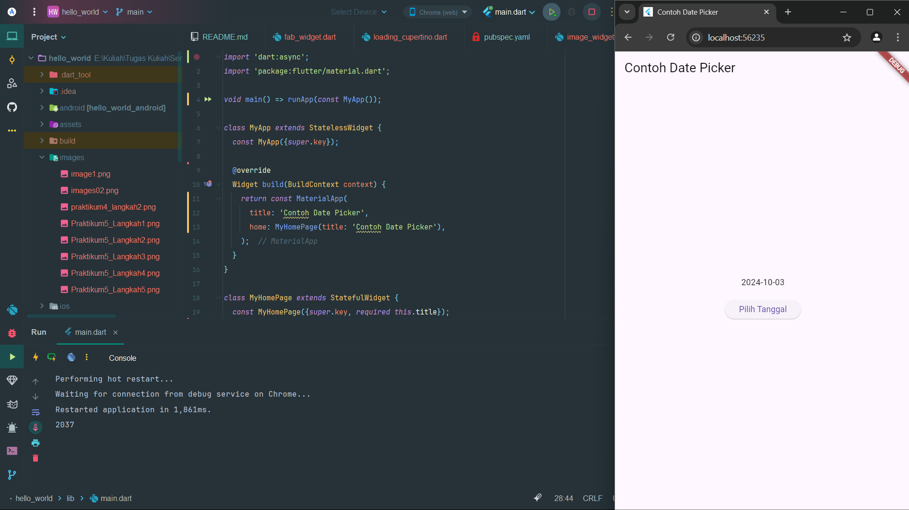

## Tugas Praktikum

Bukti

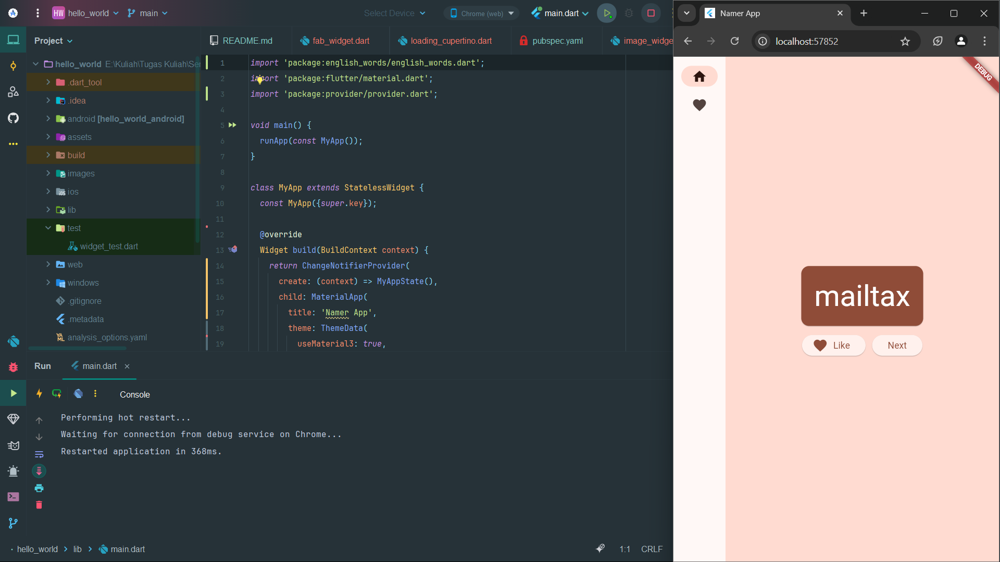
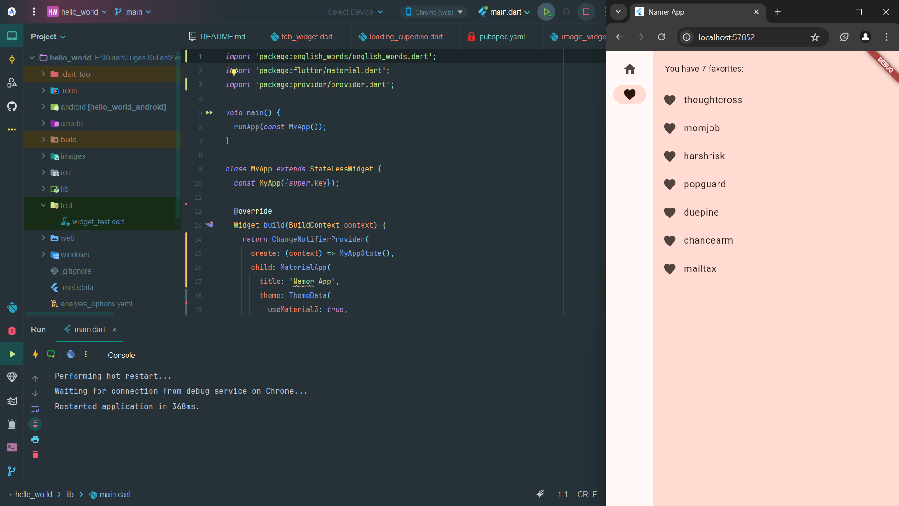
